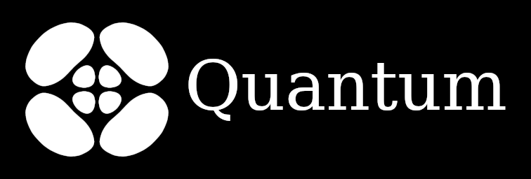
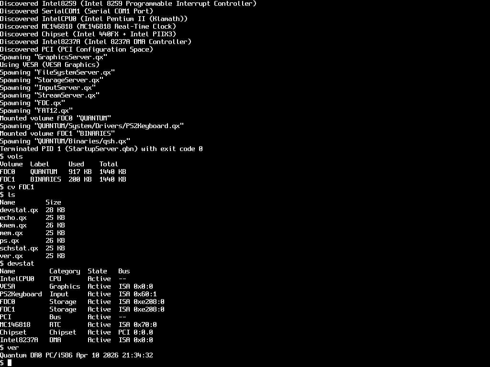
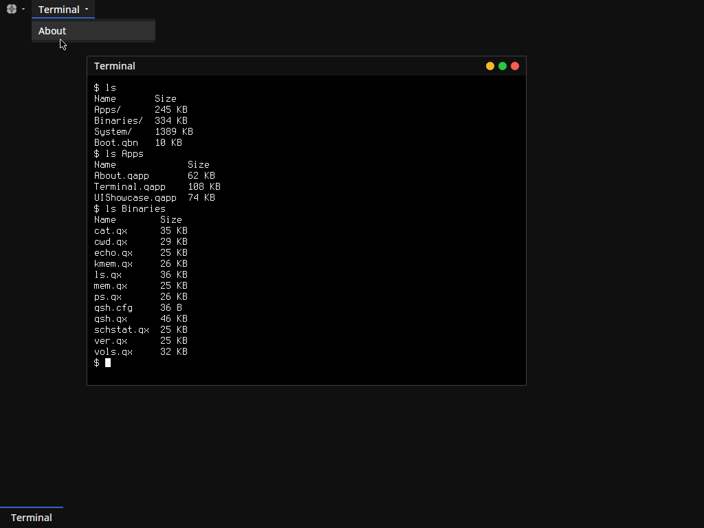

   
  Copyright © 2025-2026 The Quantum Software Project. All rights reserved. 
  Licensed under the GNU General Public License v2.0-only. 
  See LICENSE.md for details.

# Hello

Quantum is a clean, from-scratch, object-oriented C++ operating system focused
on clarity, coherence, and deliberate design. Rather than re-implementing or
imitating existing operating system architectures, Quantum is built with its own
abstractions, conventions, and long-term structure in mind.

# Screenshots

  

  

